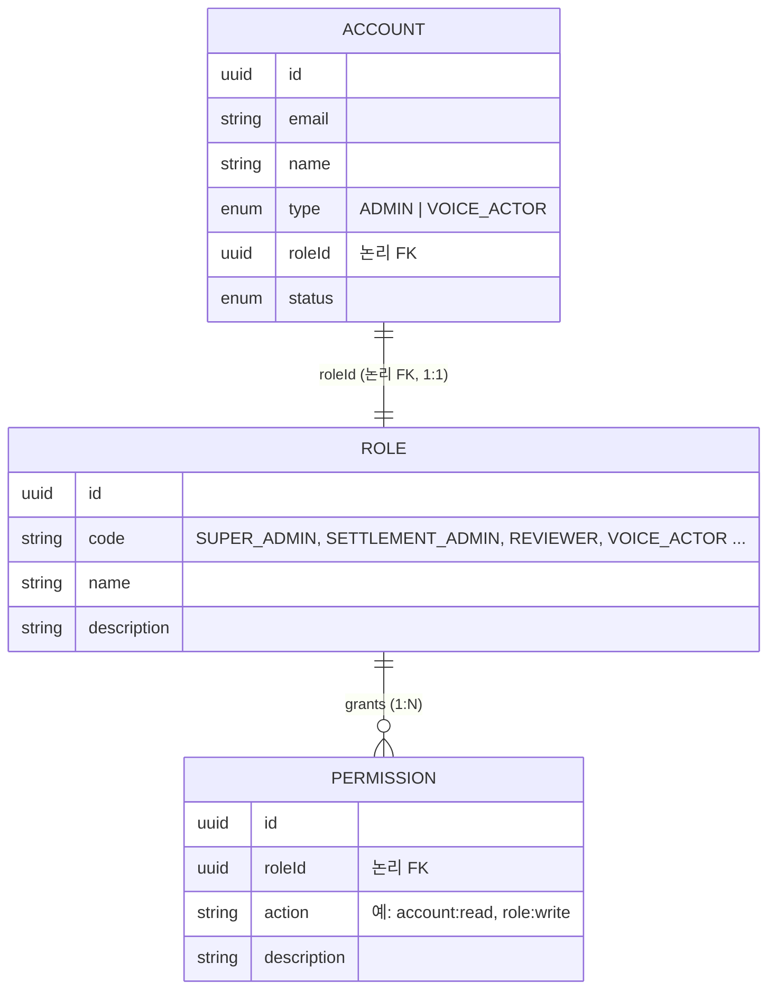

# 도메인 설계 (Domain Design)

> 본 문서는 **DDD(Domain-Driven Design) 아키텍처 + EDA(Event-Driven Architecture) 기반 프로세스**를 전제로 작성된다.
> 현 시점의 범위는 **관리자 계정 및 권한 관리**(Account / Role / Permission) 이며, 도메인이 확장되면 본 문서도 함께 갱신한다.

## 1. 아키텍처 원칙

### 1.1 DDD
- 각 도메인은 **애그리거트(Aggregate)** 단위로 일관성 경계를 가진다. (`core-api`의 `DddAggregate` 베이스)
- 애그리거트 간 참조는 **하드 FK(외래키 제약)가 아니라 식별자(ID)에 의한 논리적 참조**로 연결한다.
  - 예: `Account.roleId` 는 `Role` 을 가리키는 **논리적 FK**이며, DB 레벨의 FK 제약을 강제하지 않는다.
- 상태 변경은 도메인 메서드를 통해 일어나고, 그 결과로 **도메인 이벤트**를 발행한다.

### 1.2 EDA (Transactional Outbox + CDC)
도메인 이벤트는 다음 흐름으로 전파된다.

```
Aggregate.publishEvent()
  → DddRepository.save() 가 동일 트랜잭션에서 ddd_events(outbox) 테이블에 적재
  → Debezium(CDC) 가 ddd_events binlog 를 Kafka 토픽으로 발행
  → EventStore(consumer) 가 토픽 구독 → @EventHandler 로 등록된 핸들러로 라우팅
```

- **트랜잭셔널 아웃박스**: 비즈니스 데이터 변경과 이벤트 적재가 한 트랜잭션 안에서 원자적으로 일어난다.
- 토픽: `dbserver1.vooth.ddd_events` (Debezium `topic.prefix`.DB.테이블).
- 핸들러: `@EventHandler(SomeEvent)` 데코레이터로 이벤트 타입에 바인딩.

> 구현 상세는 [`infra.md`](../infra.md)(Kafka/Debezium) 와 `apps/core-api/src/libs/{ddd,event-store}` 참고.

---

## 2. 도메인 개요

| 도메인 | 책임 | 관계 |
|--------|------|------|
| **Account** | 사내 백오피스 관리자 계정 및 성우 계정 | Account (1) — (1) Role |
| **Role** | 역할 구분 (성우 / 슈퍼 관리자 / 정산 관리자 / 검수자 등) | Role (1) — (N) Permission |
| **Permission** | 개별 권한 정의 | Role 에 종속 |

### 관계도



---

## 3. Account

사내 백오피스 **관리자 계정**과 **성우 계정**을 모두 표현하는 도메인.

### 3.1 생성 방식 (계정 종류별로 다름)
- **관리자 계정 (`type = ADMIN`)**
  - 백오피스(`voot-back-office`)에서 **Google 로그인** 시 자동 생성(프로비저닝)된다.
  - 즉 최초 Google 로그인이 곧 계정 생성 트리거가 된다.
- **성우 계정 (`type = VOICE_ACTOR`)**
  - 셀프 가입이 없다. **백오피스에서 관리자가 직접 성우 계정을 생성**한다.

### 3.2 주요 속성(초안)
| 속성 | 설명 |
|------|------|
| `id` | 계정 식별자 (UUID) |
| `email` | 로그인/식별 이메일 (관리자는 Google 계정 이메일) |
| `name` | 표시 이름 |
| `type` | `ADMIN` \| `VOICE_ACTOR` |
| `roleId` | 연결된 Role 의 **논리적 FK** (1:1) |
| `status` | 활성/비활성 등 상태 |

### 3.3 불변식 / 규칙
- 하나의 Account 는 **정확히 하나의 Role** 을 가진다 (1:1).
- 관리자 계정은 Google 로그인 외 경로로 생성하지 않는다.
- 성우 계정은 관리자에 의해서만 생성된다.

---

## 4. Role

역할을 구분하는 도메인. 예: **성우, 슈퍼 관리자, 정산 관리자, 검수자** 등.

### 4.1 관계
- **Account (1) — (1) Role**: 한 계정은 하나의 역할을 가진다. (`Account.roleId` 논리 FK)
- **Role (1) — (N) Permission**: 한 역할은 여러 권한을 가진다.

### 4.2 주요 속성(초안)
| 속성 | 설명 |
|------|------|
| `id` | 역할 식별자 (UUID) |
| `code` | 역할 코드 (예: `SUPER_ADMIN`, `SETTLEMENT_ADMIN`, `REVIEWER`, `VOICE_ACTOR`) |
| `name` | 표시 이름 |
| `description` | 설명 |

---

## 5. Permission

개별 권한을 정의하는 도메인. **Role 에 종속**된다 (Role(1) → Permission(N)).

### 5.1 주요 속성(초안)
| 속성 | 설명 |
|------|------|
| `id` | 권한 식별자 (UUID) |
| `roleId` | 소속 Role 의 **논리적 FK** |
| `action` | 권한 식별 문자열 (예: `account:read`, `account:write`, `role:write`, `permission:write`) |
| `description` | 설명 |

### 5.2 권한 평가 흐름
```
Account → (roleId) → Role → (1:N) → Permission[]
요청 시: 해당 Account 의 Role 이 가진 Permission 집합으로 인가(authorization) 판단.
```

---

## 6. 도메인 이벤트 (EDA 관점, 초안)

각 도메인의 상태 변화는 도메인 이벤트로 발행되어 아웃박스 → CDC → Kafka 로 전파된다. (이벤트 명/페이로드는 구현 시 확정)

| 이벤트(예시) | 발생 시점 |
|--------------|-----------|
| `AccountCreated` | 관리자 Google 로그인 최초 시 / 관리자가 성우 계정 생성 시 |
| `AccountRoleChanged` | 계정의 Role 변경 시 |
| `RoleCreated` / `RoleUpdated` | 역할 생성·수정 시 |
| `PermissionGranted` / `PermissionRevoked` | 역할에 권한 부여·회수 시 |

---

## 7. 용어 정리

- **논리적 FK**: 애그리거트 경계를 넘는 참조를 ID 로만 표현하고 DB FK 제약은 두지 않는 방식 (DDD 원칙).
- **아웃박스(Outbox)**: 비즈니스 트랜잭션과 동일 트랜잭션에서 이벤트를 저장하는 테이블(`ddd_events`).
- **CDC(Change Data Capture)**: DB 변경 로그(binlog)를 캡처해 스트림으로 흘리는 기법(Debezium).
